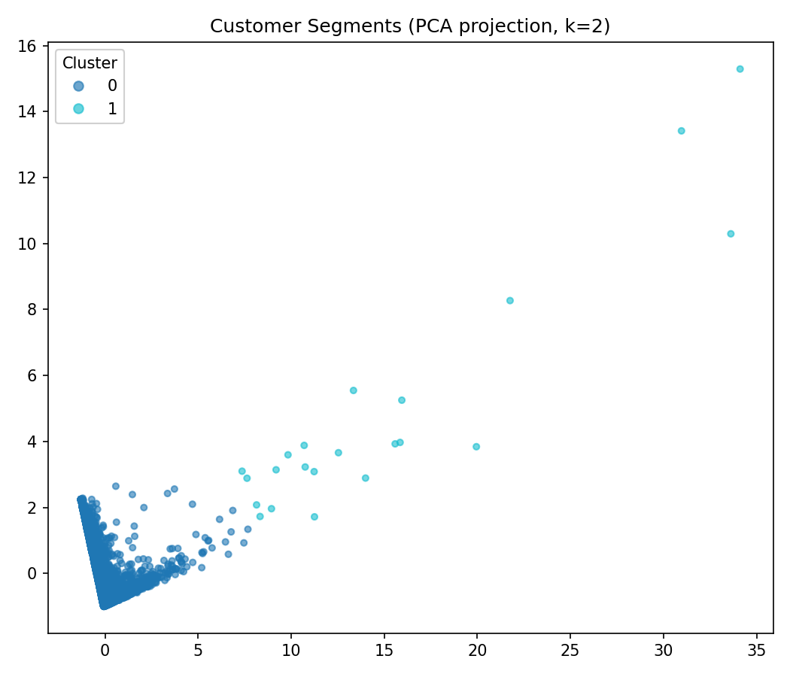
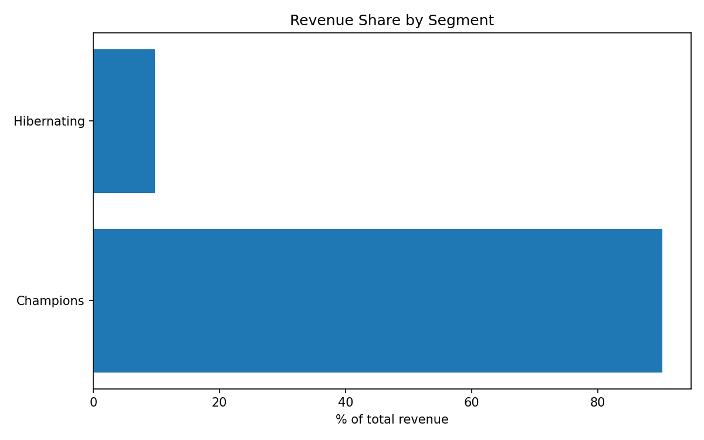

# Customer Segmentation via Clustering

RFM feature engineering + K-means clustering on real e-commerce transaction
data, with each segment translated into a concrete marketing action.

**Real dataset**: [Online Retail II dataset](https://www.kaggle.com/datasets/mashlyn/online-retail-ii-uci)
via Kaggle — 1,067,371 real transaction line items across 5,881 real
customers (after excluding cancellations and rows with no customer ID).
Not simulated.

## Segments found

k=2 chosen by silhouette score (0.418) over k=2..8 — see
`charts/k_selection.png`.

| Segment | % of customers | % of revenue | Avg. recency (days) | Avg. frequency | Avg. monetary | Action |
|---------|-----------------|----------------|----------------------|------------------|-----------------|--------|
| Champions | 45.5% | 90.2% | 63.1 | 11.6 | $5,979.58 | Enroll in a loyalty/VIP rewards program to protect this high-value relationship. |
| Hibernating | 54.5% | 9.8% | 317.1 | 1.9 | $540.15 | Low-cost re-engage email; deprioritize spend versus other segments. |

**What this tells you**: the customer base splits cleanly into two
behavioral groups, not a richer multi-tier hierarchy — a Champions segment
that is just under half of all customers (45.5%) drives 90.2% of total
revenue, so retention spend should concentrate on a loyalty/VIP program for
that group rather than being spread evenly across the base.




## Method

- RFM (Recency, Frequency, Monetary) computed per customer from real
  invoice-level transactions (`analysis/rfm.py`), excluding cancellations
  and rows with no customer ID.
- Frequency and Monetary are log1p-transformed before scaling (both are
  heavily right-skewed in the raw data — skew ≈ 12.7 and ≈ 25.3
  respectively); Recency is left untransformed (skew ≈ 0.89, mild).
  Features are then standardized and K-means is fit across k=2..8, with k
  chosen by silhouette score (`analysis/clustering.py`).
- Each real cluster is labeled against the overall customer base's median
  RFM values and mapped to a concrete marketing action
  (`analysis/segment_actions.py`).

## Run it locally

```bash
python3 -m venv venv && source venv/bin/activate
pip install -r requirements.txt
python run_analysis.py       # real end-to-end run, saves charts/ and cluster_profile.csv
jupyter notebook notebooks/segmentation.ipynb   # narrative walkthrough
```

## Live demo

Not yet deployed — static charts above and the notebook are the current
deliverable; a live demo link will be added here after deployment.

## Notes

- Requires Kaggle API credentials (`~/.kaggle/kaggle.json`); the raw
  dataset itself is not committed to this repo.
- Not a classification project — this is unsupervised segmentation,
  distinct from the classification-style projects already in the BI
  dashboard portfolio.
- k=2 is the genuine silhouette-selected result, not a forced choice — an
  earlier run before the log1p fix produced a degenerate 22-vs-5,859
  outlier split; after correcting for skew, silhouette scores decline
  smoothly from k=2 (0.418) through k=8 (0.317), with k=2 the real maximum.
