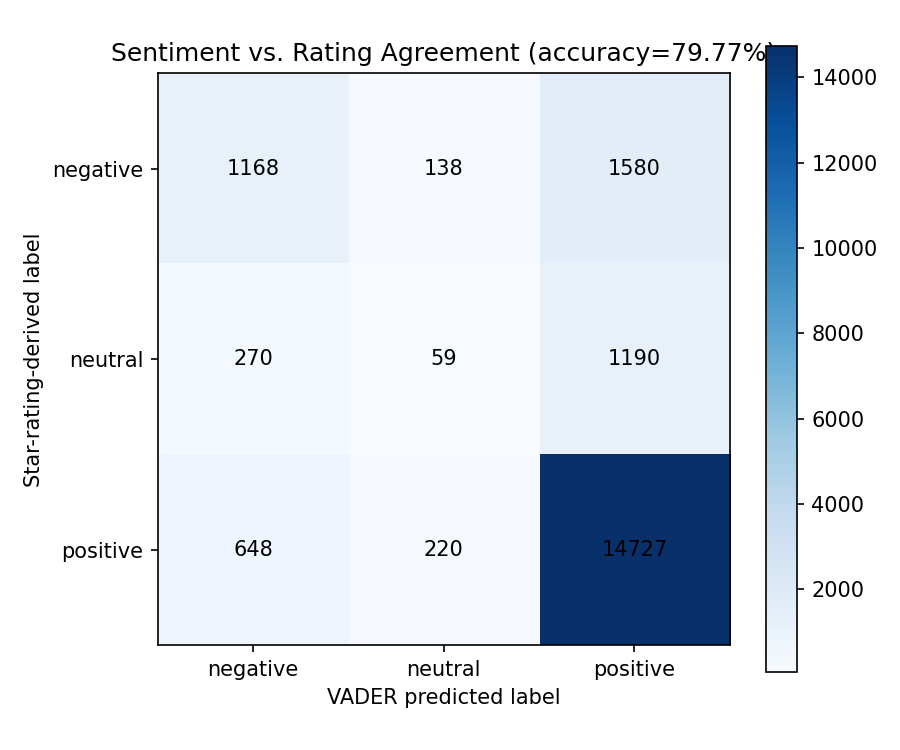
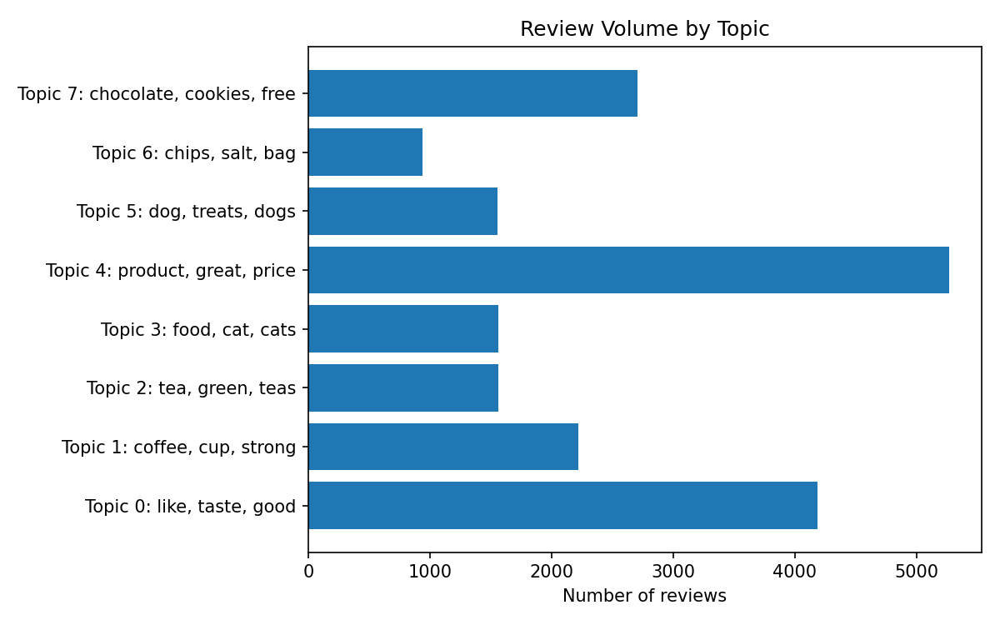

# NLP Sentiment & Topic Analysis

Sentiment classification and topic extraction on real Amazon product
reviews — classic/local NLP (VADER + NMF), no external API calls.

**Real dataset**: [Amazon Fine Food Reviews](https://www.kaggle.com/datasets/snap/amazon-fine-food-reviews)
via Kaggle. Analyzed on a reproducible random sample of 20,000 reviews (seed=42) out
of the full ~568k — stated honestly, not the full dataset.

## Sentiment: does VADER agree with the star rating?

Ratings 4-5 -> "positive", 3 -> "neutral", 1-2 -> "negative"; VADER's
compound score thresholded the same way.

**Agreement with real star ratings: 79.77%** (15,954/20,000)

| true \ predicted | negative | neutral | positive |
|---|---|---|---|
| negative | 1,168 | 138 | 1,580 |
| neutral | 270 | 59 | 1,190 |
| positive | 648 | 220 | 14,727 |



**What this tells you**: the 79.77% headline is real but somewhat inflated
by class imbalance — about 78% of this sample is star-rating-positive, so
even an "always predict positive" baseline would land close to that
number. Looking at the crosstab instead of the single accuracy figure:
VADER is genuinely strong on positive reviews (14,727/15,595 correctly
classified) and reasonable on negative ones (1,168/1,886), but it is weak
on neutral/mixed sentiment — only 59 of 1,519 true-neutral (3-star)
reviews were classified as neutral, with most instead pulled toward
positive (1,190) or negative (270). In short: VADER reliably separates
clearly positive from clearly negative reviews, but it can't detect the
"it's fine, not great" middle ground that 3-star ratings represent.

## Topics found (NMF, 8 topics)

| Topic | Reviews | Top words |
|-------|---------|-----------|
| 0 | 4,707 | like, taste, good, flavor, chocolate, just, really, sugar, sweet, don |
| 1 | 2,056 | coffee, cup, strong, cups, bold, flavor, roast, like, keurig, smooth |
| 2 | 2,423 | br, water, bag, pack, ingredients, want, salt, review, natural, box |
| 3 | 1,530 | tea, green, teas, drink, bags, black, stash, iced, cup, chai |
| 4 | 1,477 | food, cat, cats, eat, dry, canned, dog, foods, chicken, old |
| 5 | 5,248 | product, great, amazon, price, order, store, buy, time, stores, shipping |
| 6 | 1,559 | dog, treats, dogs, loves, treat, love, training, small, chew, teeth |
| 7 | 1,000 | chips, salt, bag, potato, chip, snack, love, kettle, flavor, vinegar |

Topic 5 (product/purchase-experience language — price, order, shipping,
store) is the largest, at 5,248 of 20,000 reviews (~26.2%). The rest split
fairly cleanly along product category: sweets/chocolate (0), coffee (1),
packaging/ingredients (2), tea (3), pet food (4), dog treats (6), and
snack chips (7).



## Method

- Sentiment: VADER (`nltk.sentiment.SentimentIntensityAnalyzer`), a
  lexicon/rule-based model — free, local, no training data needed
  (`analysis/sentiment.py`).
- Topics: TF-IDF + NMF over the review text (`analysis/topics.py`).
- Chosen over the Claude API specifically to keep this project free to
  run and fully reproducible by anyone who clones the repo.

## Run it locally

```bash
python3 -m venv venv && source venv/bin/activate
pip install -r requirements.txt
python -c "import nltk; nltk.download('vader_lexicon')"
python run_analysis.py     # real end-to-end run
streamlit run app.py       # interactive demo
```

## Live demo

_pending deployment_

## Notes

- Requires Kaggle API credentials (`~/.kaggle/kaggle.json`); the raw
  dataset is not committed to this repo.
- Everything above is generated by `run_analysis.py` — see that file for
  the exact computation.
